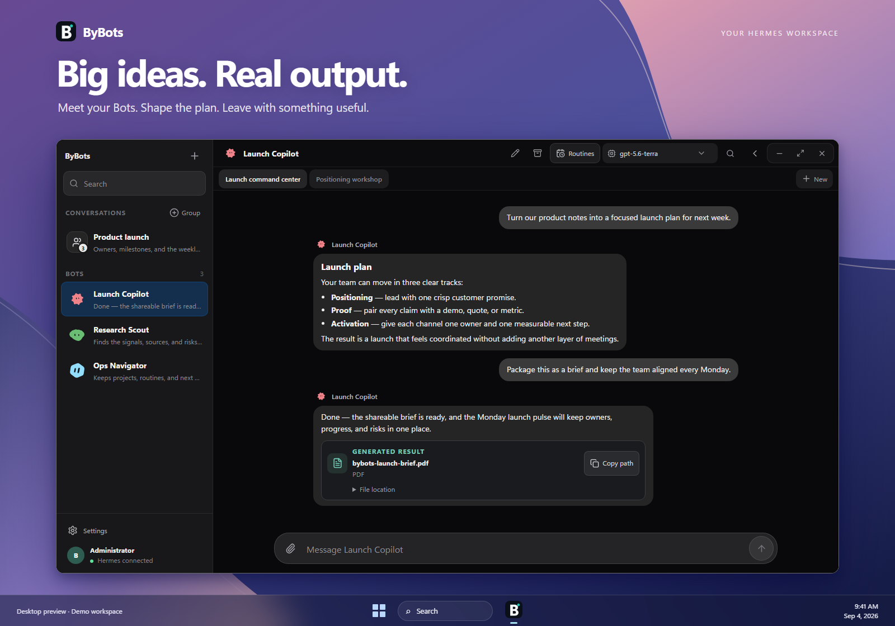
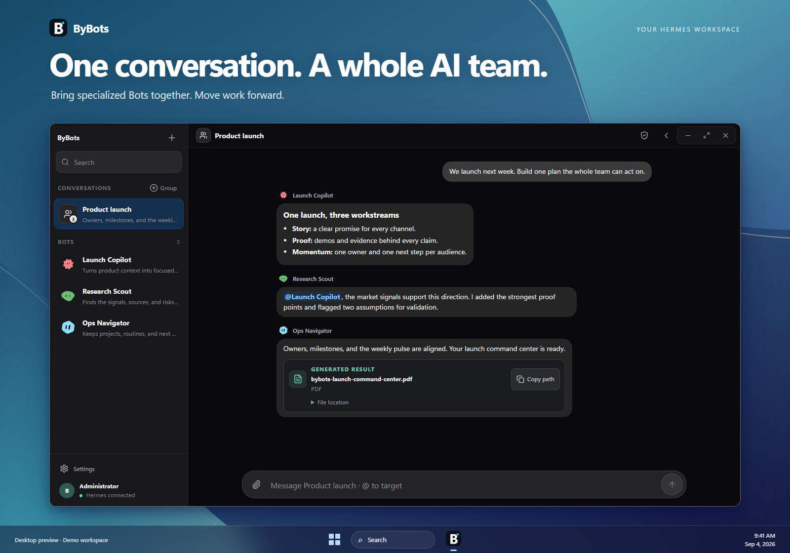
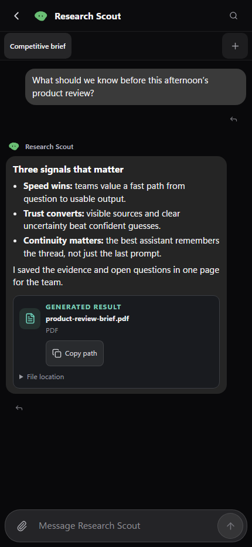

# ByBots

[](https://github.com/Mazzana/bybots/actions/workflows/ci.yml)
[](LICENSE)
[](CHANGELOG.md)

**A focused workspace for building, running, and supervising your Hermes AI
team.**

ByBots turns a Hermes gateway into an approachable Web and desktop product.
Create specialized Bots around real missions, return to the right conversation,
coordinate several Bots in one room, schedule recurring work, and understand
model usage from a single interface.

Hermes remains the agent runtime and source of truth. ByBots adds the product
experience around it: navigation, continuity, safeguards, access control, and a
Bridge that keeps gateway credentials away from the browser.

[Get started](#quick-start-from-source) · [Explore the product](#product-tour) ·
[Installation](docs/INSTALLATION.md) · [User guide](docs/USER-GUIDE.md) ·
[Self-hosting](docs/SELF-HOSTING.md) · [Changelog](CHANGELOG.md)

> **Current preview: `0.3.1-alpha.1`.** ByBots is ready for development and
> evaluation. Signed distribution and clean-machine qualification are still
> required before the first supported public release.

## See ByBots in action

**Big ideas. Real output.**



**One conversation. A whole AI team.**



*Real ByBots interface with demo conversations, presented in a styled desktop
scene. Wallpapers and taskbar are presentation elements, not part of ByBots.*

<details>
<summary>See the mobile conversation experience</summary>



</details>

The same responsive interface runs in the browser and inside the Windows or
macOS desktop shell. On mobile, the navigation gets out of the way when a
conversation is open so the experience behaves like a messaging application.

## Why ByBots

Hermes provides the profiles, sessions, memory, routines, tools, and model
connections that make an agent useful. ByBots makes those capabilities easier
to operate every day.

| Need | What ByBots adds |
| --- | --- |
| Stay in context | Multiple threads per Bot, recent work, local drafts, and automatic restoration of the last conversation |
| Build useful assistants | A mission-first Bot editor for identity, model, instructions, tools, and MCP access |
| Coordinate work | Multi-Bot group rooms with visible speakers, mentions, live progress, and stop controls |
| Automate carefully | Native Hermes routines with schedules, run history, local-time context, and confirmation before manual execution |
| Understand activity | Token, call, session, cache, reasoning, and per-model usage without fabricating unavailable costs |
| Connect safely | Local or remote Hermes through native OAuth PKCE or session tokens, mediated by the server-side Bridge |
| Work anywhere | One responsive React experience for Web, Windows, macOS, and phone-sized screens |

ByBots is useful when one generic chat is no longer enough: for example, when a
research Bot, an operations Bot, and a writing Bot need separate identities and
histories but should still be available in one calm workspace.

## Product tour

### 1. Connect to Hermes

The first-run guide takes the user from gateway selection to a first result.
Use a local Hermes runtime, enter a trusted remote gateway, or complete the same
native OAuth flow used by Hermes Desktop. The application tests the connection
before saving it and gives actionable recovery states when authentication or
the WebSocket connection fails.

Hermes credentials never need to be exposed to the React application. The
Bridge performs token and OAuth exchanges, validates the authenticated Hermes
contract, and returns only the product data the interface needs.

### 2. Create a Bot around a mission

A Bot is backed by a native Hermes profile. Its configuration workspace brings
together:

- display identity, avatar, and mission;
- model selection and system instructions;
- tool, browser, filesystem, terminal, and MCP capabilities;
- memory and behavior documents managed by Hermes;
- least-privilege access choices that remain visible before saving.

Unsaved changes are summarized by section. No-op saves stay disabled, and
closing an edited configuration requires confirmation, reducing accidental
loss or overly broad access changes.

### 3. Work without losing the thread

Every Bot can keep several independent Hermes threads. ByBots restores the last
opened conversation, surfaces recent work, and saves a separate unfinished
draft for every Bot thread and group room.

The composer supports bounded text, Markdown, source-code, structured-data, and
log attachments. Their content is sent inline; a machine-local path is never
forwarded to a remote gateway. Responses stream live with retry, reconnect, and
bounded polling fallbacks. Long threads open on their newest messages and load
older history in manageable batches. Generated HTTP or HTTPS results can be
opened from a dedicated card, while local paths remain copy-only.

### 4. Bring several Bots into one room

Group discussions let selected Bots contribute in sequence to one shared
objective. Messages retain the speaking Bot's avatar and identity, and mentions
of the user or another Bot are visually distinct. The interface exposes live
run state and provides a clear stop action instead of hiding background work.

### 5. Turn repeatable work into routines

ByBots presents native Hermes routines beside each Bot. Operators can inspect
the prompt, schedule, enabled state, recent runs, and required access before
starting work. Administrators can create, update, pause, or remove routines.
Schedules are shown in the device's local time zone.

### 6. Review usage and move your data

The Usage area shows total tokens and each model's share, plus calls, sessions,
cache reads, and reasoning tokens when Hermes provides them. If overall and
per-model counters differ, ByBots labels the discrepancy instead of silently
forcing the numbers to match. Monetary cost remains hidden until Hermes exposes
a stable, verified billing contract.

Administrators can export and import bounded Hermes Bot profile archives from
Settings. Sanitized diagnostics are previewed before download and omit gateway
addresses, credentials, Bot names, conversations, and other user content.

## How it fits with Hermes

```text
Browser / Windows / macOS
          │
          │  ByBots UI
          ▼
ByBots Bridge — policy, roles, OAuth, validation, redaction
          │
          │  authenticated HTTP + WebSocket
          ▼
Hermes 0.21.x — profiles, sessions, memory, routines, tools, models
```

This separation is deliberate:

- **Hermes owns agent state.** Submitted conversations, profiles, memory,
  routines, and tools are not copied into a competing ByBots database.
- **The Bridge owns the trust boundary.** It validates input, protects secrets,
  enforces `admin`, `operator`, and `viewer` roles, and normalizes Hermes errors.
- **The client owns presentation state.** Language, density, the selected
  thread, and bounded unfinished drafts stay in the current browser or Electron
  profile.

See [Architecture](docs/ARCHITECTURE.md),
[Bridge API v1](docs/BRIDGE-API.md), and
[Hermes compatibility](docs/HERMES-COMPATIBILITY.md) for the complete contract.

## Quick start from source

### Requirements

- Node.js `22.12` or newer, up to the `24.x` line;
- npm `10` or newer;
- Hermes CLI `0.21.x` available in `PATH` for the integrated development stack.

### Start Web development

```bash
git clone https://github.com/Mazzana/bybots.git
cd byfinity-bots
npm ci
npm run dev
```

This command starts:

- a development Hermes runtime on `127.0.0.1:9120`;
- the ByBots Bridge on `127.0.0.1:4179`;
- the Vite interface on `http://127.0.0.1:5188`.

Open the Vite URL, complete the guided first launch, create a Bot, and send a
non-sensitive test message.

### Start the desktop application

```bash
npm run dev:desktop
```

The Electron shell starts the same development stack and loads ByBots through
its embedded loopback Bridge. Node integration stays disabled in the renderer,
the renderer is sandboxed, and external links open through the operating
system.

If Hermes is already running or you are installing a packaged candidate, use
the full [installation guide](docs/INSTALLATION.md).

## Self-host beside an existing Hermes

The production configuration starts **ByBots only**. It does not launch or
replace the existing Hermes service.

```bash
cp .env.production.example .env.production
docker compose -f compose.production.yaml config
docker compose -f compose.production.yaml up -d --build
curl -fsS http://127.0.0.1:4179/api/health
```

The recommended deployment keeps both Hermes and the Bridge on private or
loopback interfaces, then exposes only ByBots through an authenticated private
network such as Tailscale Serve or an identity-aware proxy. Never publish the
Hermes gateway directly to the internet.

Follow [Self-hosting](docs/SELF-HOSTING.md) for volumes, profile transfer,
upgrades, backups, and post-deployment checks, and
[Deployment](docs/DEPLOYMENT.md) for the security invariants.

## Privacy and security model

ByBots is designed to make sensitive boundaries visible rather than pretending
that agent data is harmless.

- Gateway and OAuth credentials remain server-side.
- Remote access should use an authenticated private network and individual
  Bridge roles.
- Local drafts may contain private text; they stay in the current client profile
  and do not synchronize or appear in server backups.
- Text attachments are size- and type-bounded before submission. Binary and
  multimodal uploads remain unavailable until Hermes exposes a verified
  contract.
- Profile archives and raw operational logs may contain private data and must
  never be attached to a public issue.
- **Settings → Data → Sanitized diagnostics** prepares a redacted report for
  support without including conversations, credentials, addresses, or Bot
  identities.

Read the [security policy](SECURITY.md) before exposing a deployment or sharing
diagnostics.

## Current platform status

| Surface | Target | Status for `0.3.1-alpha.1` |
| --- | --- | --- |
| Windows | Windows 11 x64 | Package generation works; signing and clean-machine qualification remain |
| macOS | macOS 13+, Intel and Apple Silicon | Universal candidate configured; signing, notarization, and clean-machine qualification remain |
| Web / Bridge | Debian 12 x64, Node.js 24 | Production container and checks exist; live deployment qualification remains |
| Hermes | `0.21.x` | Automated contract coverage exists; a live check is required for each supported deployment |

This table distinguishes build capability from official product support. See
[Support](docs/SUPPORT.md) and [Releasing](docs/RELEASING.md) for the remaining
release gates.

## Development and verification

```bash
npm ci
npm test
npm run build
npx playwright install chromium
npm run test:e2e
```

The automated suite covers the Bridge contract, Hermes adapters, connection and
OAuth flows, threads, groups, routines, responsive UI behavior, localization,
packaging rules, public documentation, and production bundle budgets.

Before contributing, read [CONTRIBUTING.md](CONTRIBUTING.md) and the complete
[testing guide](docs/TESTING.md). Product changes belong in
[CHANGELOG.md](CHANGELOG.md); qualification evidence and release gates belong
in the release documentation.

## Documentation

- [Installation](docs/INSTALLATION.md) — source, Windows, macOS, and first run
- [User guide](docs/USER-GUIDE.md) — Bots, conversations, groups, routines, and usage
- [Troubleshooting](docs/TROUBLESHOOTING.md) — connection, drafts, attachments, and notifications
- [Self-hosting](docs/SELF-HOSTING.md) — private deployment, upgrades, and backups
- [Architecture](docs/ARCHITECTURE.md) — components, data flows, and persisted state
- [Bridge API](docs/BRIDGE-API.md) — roles, routes, errors, and compatibility
- [Releasing](docs/RELEASING.md) — versioning, artifacts, signing, and qualification
- [Documentation index](docs/README.md) — every public guide

## License

ByBots is open source under the [MIT license](LICENSE).
